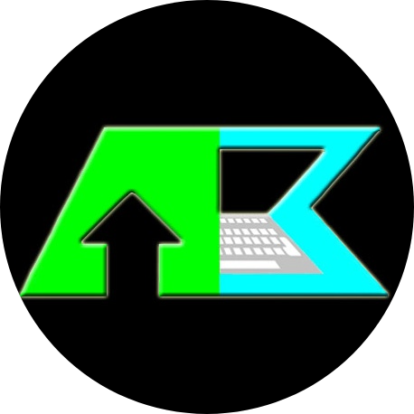

# Welcome to my GitHub!

My name is Andrew Krause, and I am a Computer Science student at the Univeristy of Wisconsin - La Crosse, Wisconsin, USA. I recently completed a Software Development internship with Kwik Trip Inc this past summer of 2022. In my internship, I utilized technologies such as ASP.NET Core Blazor and Telerik. I am looking forward to more job opportunities upon graduating from college! I am expecting to graduate in December of 2022.

Besides my academic work, I enjoy working on improving my web development skills by creating my own projects and hosting them online. For future projects, I am planning on creating a simple game using Unity as well as making a mobile application.

My main areas of interest in Computer Science include: Web development, cybersecurity, and game design.
Feel free to check out my repos! I have different repositories that implement a variety of concepts in Computer Science such as simple games, data structures, and web applications.

<!--

  
&nbsp;&nbsp;&nbsp;
-->

<!--
**Andrew-EKrause/Andrew-EKrause** is a ✨ _special_ ✨ repository because its `README.md` (this file) appears on your GitHub profile.

Here are some ideas to get you started:

- 🔭 I’m currently working on ...
- 🌱 I’m currently learning ...
- 👯 I’m looking to collaborate on ...
- 🤔 I’m looking for help with ...
- 💬 Ask me about ...
- 📫 How to reach me: ...
- ⚡ Fun fact: ...
-->
